Water Pumps
==============================

Forecasting water pumps failure

Project Organization
------------

    ├── LICENSE
    ├── README.md
    ├── data
    │   ├── processed
    │   ├── raw
    │   └── interim
    │
    ├── models
    │
    ├── notebooks
    │
    ├── reports
    │   └── figures 
    │	    ├── data_preparation
    │       ├── EDA
    │       └── Modelling
    │
    └── src
        ├── __init__.py
        │
        ├── data
        │   └── make_dataset.py
        │
        ├── models
        │   ├── modelling.py
        │   └── predictions.py
        │
        └── visualization 
            └── visualize.py

--------
# Water Pumps

## Introduction

Using data from [Taarifa](http://taarifa.org/) and the [Tanzanian Ministry of Water](http://maji.go.tz/), the goal of this project is to predict which Tanzanian water pumps are functional, which need some repairs, and which don't work at all, based on a number of variables about what kind of pump is operating, when and where it was installed, and how it is managed. A smart understanding of which waterpoints will fail can improve maintenance operations and ensure that clean, potable water is available to communities across Tanzania.

## Getting Data

The data for this comeptition comes from the Taarifa waterpoints dashboard, which aggregates data from the Tanzania Ministry of Water. Taarifa is an open source platform for the crowd sourced reporting and triaging of infrastructure related issues, some sort of a bug tracker for the real world which helps to engage citizens with their local government. 

The data can be downloaded from [Driven Data](https://www.drivendata.org/competitions/7/pump-it-up-data-mining-the-water-table/data/)

Due to the size of the dataset, some of the processed files (e.g. the prepared training array X_train) and models won't be uploaded to this repository.

## Exploratory Data Analysis

There is a total of 40 features and around sixty thousand rows of training data. An initial inspection of this dataset shows several important characteristics: There is a really high cardinality in some of the features, even in the thousands of different values, and some of the features are very similar to each other, in some cases being merely a more detailed version of another feature.

The data seems to be quite complete, with only 7 features out of the 40 missing any value at all, but this turned up to be a bit misleading, since some of the missing data was just filled in the form of 0s.

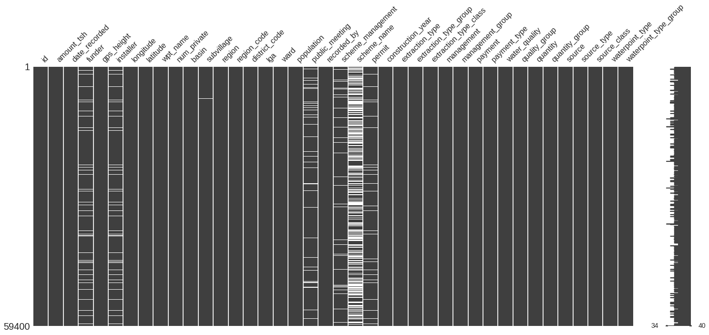

We can see that the label distribution is mainly divided into functional and non functional water pumps, with a third case, the functioning pumps that nevertheless require some reparation, accounting for less than 10% of all the records.

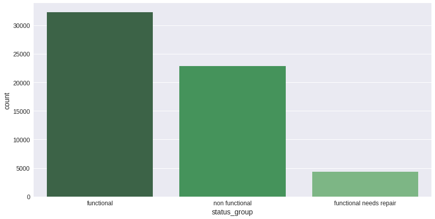

One of the most obvious features for pump status prediction is the waterpoint construction year. We could expect that the oldest water pumps are more prone to failures, and in fact this is what the data shows too.

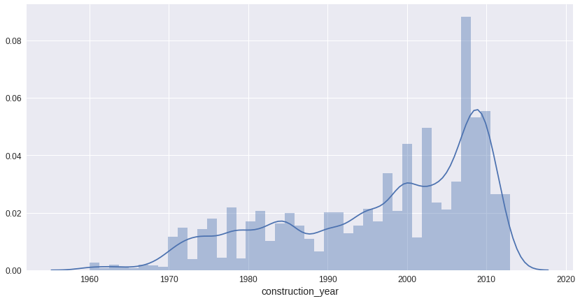

As we can see, there is a spike in water pump construction around 2008-2010. Also, as expected, there is a positive correlation between construction year and water pump state, with the functioning water pumps being much more concentrated among those constructed precisely in the spike years around 2010:

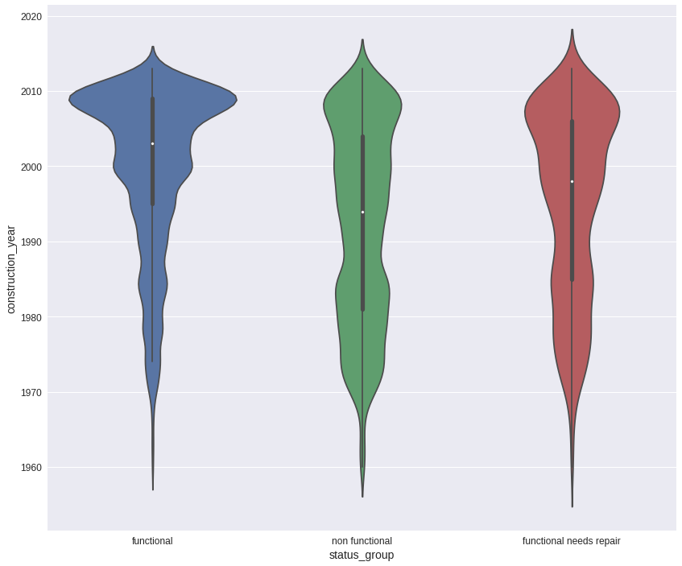

We can see the geographical distribution of the water pumps marking the size of the population of the village through all the Tanzanian territory to get some more info:

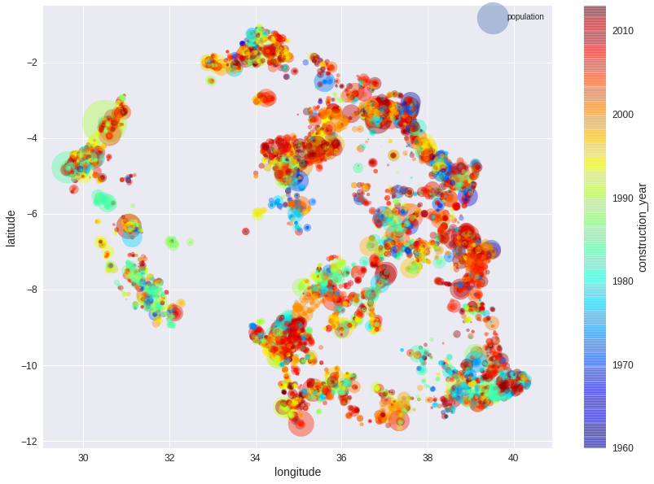

We can see how there are big regions in the country whithout a single water pump, and how most of the pumps are concentrated in the coast, as is the population itself.

Analyzing the relationship of the features among themselves, a correlation heatmap of the numerical features shows us some meaningful relations:

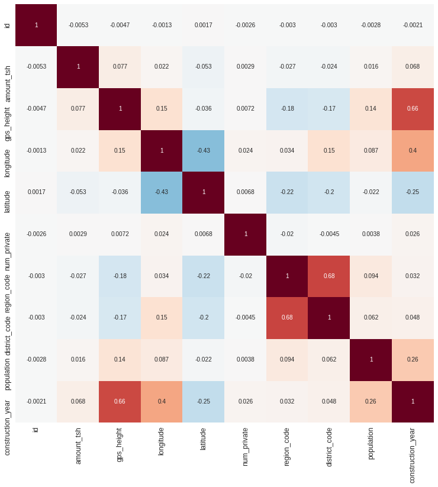

We can see how district and region codes are highly correlated, nothing unexpected here, but also how height and construction year are very correlated too, indicating that the newest pumps tended to be constructed in increasingly higher heights. We can see also how the construction year is positively correlated with the water pump longitude, which means that the newest pumps will tend to be on the eastern zones of the country, but it is also negatively correlated (although this correlation is not so strong) with the latitude, meaning that the newest pumps will tend to be in the south.

There is a list of mosaic plots (see the full notebooks) showing relationships of two categorical features like the one below, where we can see how the water source class has a similar distribution for functional and non functional pumps, but this relationship is quite different for functioning pumps that need repairing:

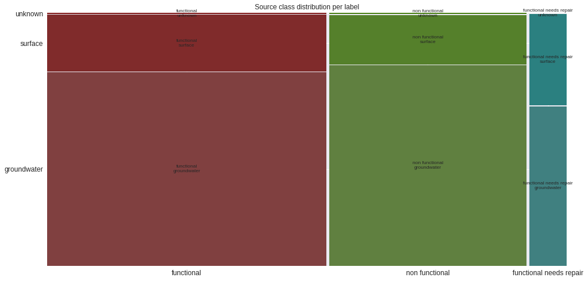

## Data Preparation

There is a number of tasks to be done in the original dataset that need to be done in order to feed it to the models. First of all, the latitude, longitude and construction year, which should not be inferred from the rest of the data, had to be cleaned, replacing NaNs and 0s to means. After that, another numerical feature, in this case the height, could in this case be predicted from latitude and longitude. Below is the comparison of the water pump heights before and after the model was applied.

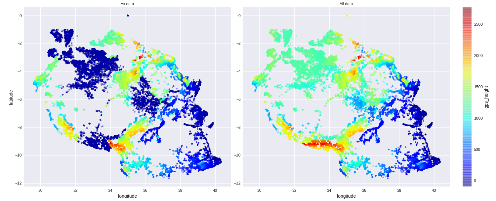

Another important task is to get rid of the excess of cardinality present in the data. A total of 8 of the 40 features could be dropped (meaningless and redundant features), while the cardinality of the remaining features was reduced from 65k to 2k different values which, after standarization and vectorization, were reduced even more to 100 features using PCA, keeping most of the variance of the data, but only a small percentage of its original cardinality.

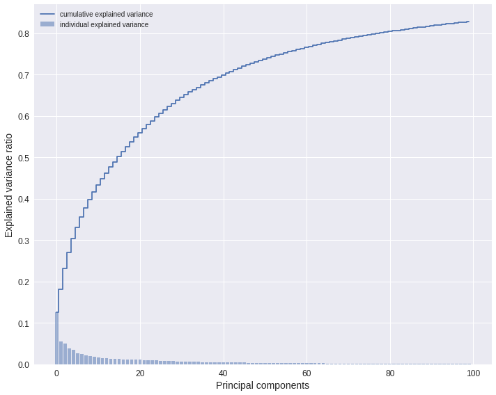

Testing shows that the cross validation accuracy of a Random Forest classifier on both the PCA reduced data and the full original data performs very similarly.

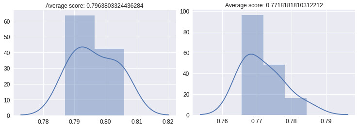

## Modelling

A number of classifiers were tested on the cleaned data to get a sense of the most appropriate ones:

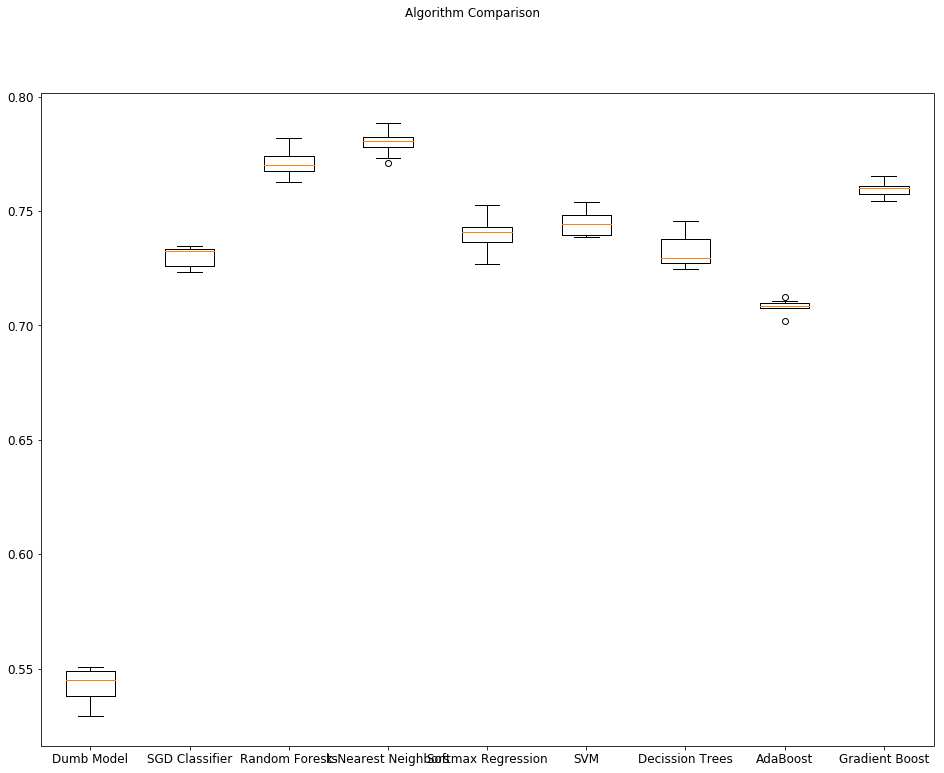

In the figure, the comparison is made versus a "Dumb Model" classifier, made to predict always the most common label ("functioning" pump), to be sure that the rest of the models were actually doing it right. As shown in the graph, the Random Forest classifier performed better than any other model before optimization, with a confusion matrix as follows:

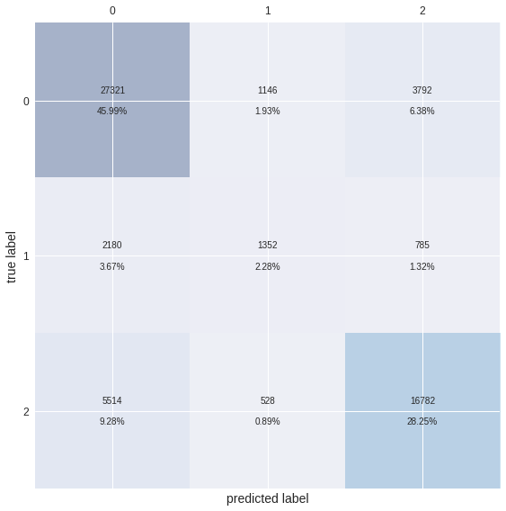

After optimization of several models, and stacking and ensembling some of them together, the best model ended up being an optimized version of a Random Forest - XGBoost ensemble classifier, which was finally the one used to make the final predictions.
